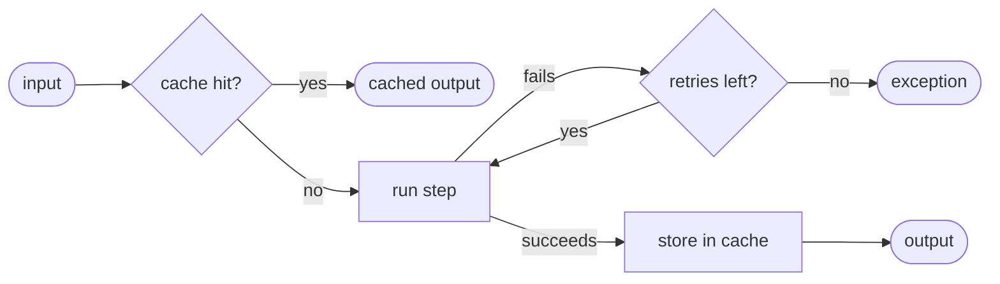

# Retry and cache

Each step reference in a use case can carry `settings`. Settings apply only to that use case, so the same step
can be retried in one use case and not in another.

```yaml
steps:
  - step: saveOrder
    settings:
      retry:
        max-retries: 3
        delay: 100ms
      cache:
        name: orders
        key: "#input.id"
```

When both are set, the cache is checked first. A cache hit skips the step and its retries.



## Retry

Retry uses Spring Framework's core retry support (`RetryTemplate`).

| Property | Default | Description |
|---|---|---|
| `max-retries` | `3` | Retries after the first attempt |
| `delay` | `1s` | Delay before the first retry |
| `multiplier` | `1.0` | Factor applied to the delay after each retry |
| `max-delay` | unlimited | Upper bound for the delay |
| `jitter` | `0` | Random jitter added to each delay |
| `timeout` | `0` (none) | Maximum total time spent retrying |
| `includes` | all | Exception classes that trigger a retry |
| `excludes` | none | Exception classes that never trigger a retry |

When all retries fail, the last exception thrown by the step reaches the caller as it is.

Retry can also be declared on the step itself. YAML settings take precedence:

=== "Kotlin"

    ```kotlin
    @Step(retry = Retryable(maxRetries = 2, delay = 100))
    fun saveOrder(request: OrderRequest): OrderEntity { /* ... */ }
    ```

=== "Java"

    ```java
    @Step(retry = @Retryable(maxRetries = 2, delay = 100))
    public OrderEntity saveOrder(OrderRequest request) { /* ... */ }
    ```

## Cache

Cache uses Spring's cache abstraction, so any `CacheManager` works (Caffeine, Redis, ...).

| Property | Required | Description |
|---|---|---|
| `name` | yes | Cache name in the application's `CacheManager` |
| `key` | no | SpEL expression evaluated against the step input, available as `#input`. Defaults to the input itself (it then needs proper `equals`/`hashCode`). |

Cache can also be declared on the step itself. YAML settings take precedence:

=== "Kotlin"

    ```kotlin
    @Step(cache = Cached(name = "orders", key = "#input.id"))
    fun findOrder(request: OrderIdRequest): OrderEntity { /* ... */ }
    ```

=== "Java"

    ```java
    @Step(cache = @Cached(name = "orders", key = "#input.id"))
    public OrderEntity findOrder(OrderIdRequest request) { /* ... */ }
    ```

The application needs a `CacheManager` bean. With Spring Boot, add `spring-boot-starter-cache` and `@EnableCaching`.
If a step uses a cache and no `CacheManager` exists, or the cache name is unknown, startup fails.

!!! note
    Enact reads from and writes to the cache but never evicts entries. Configure expiry in your cache
    provider, or evict entries yourself through the `CacheManager` when the underlying data changes.
    The demo's `cancelOrder` step does this:

    ```kotlin
    @Step
    fun cancelOrder(request: OrderIdRequest) {
        requireNotNull(orders.remove(request.id)) { "Order ${request.id} not found." }
        cacheManager.getCache("orders")?.evict(request.id)
    }
    ```
