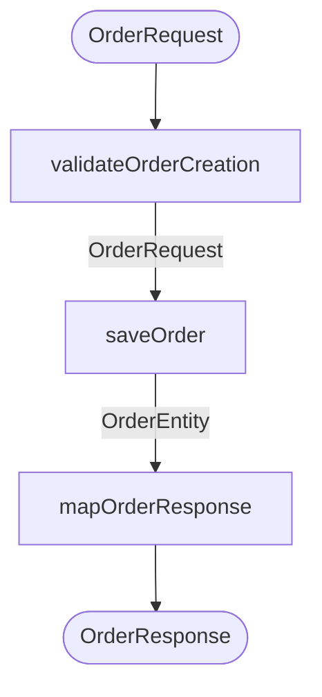

# Use cases

A use case is an ordered list of steps, defined under `enact.use-cases`:

```yaml title="application.yaml"
enact:
  use-cases:
    - name: createOrder # (1)!
      description: Validates and stores a new order
      trigger: { ... } # (2)!
      steps:
        - step: validateOrderCreation
        - step: saveOrder
          settings: { ... } # (3)!
        - step: mapOrderResponse
```

1.  Bean name of the use case. Must be unique.
2.  Optional, at most one. See [HTTP trigger](http-trigger.md) or [Custom trigger](custom-trigger.md).
3.  Optional, see [Retry and cache](step-settings.md).

The input of the use case is the input of its first step, and its output is the output of its last step.
Each step receives the output of the previous one:



## Validation

Enact checks every use case when it is created during startup:

- it has at least one step,
- every referenced step exists, and
- each step's output type equals the next step's input type.

If any check fails, the application does not start. The error names the use case and steps involved.

## Injecting a use case

Every use case is a Spring bean of type `UseCase<Input, Output>`. You can inject it by its type:

=== "Kotlin"

    ```kotlin
    @RestController
    class OrderController(
        private val createOrder: UseCase<OrderRequest, OrderResponse>,
    ) {
        @PostMapping("/orders")
        fun create(@RequestBody payload: OrderRequest): OrderResponse = createOrder.execute(payload)
    }
    ```

=== "Java"

    ```java
    @RestController
    public class OrderController {
        private final UseCase<OrderRequest, OrderResponse> createOrder;

        public OrderController(UseCase<OrderRequest, OrderResponse> createOrder) {
            this.createOrder = createOrder;
        }

        @PostMapping("/orders")
        public OrderResponse create(@RequestBody OrderRequest payload) {
            return createOrder.execute(payload);
        }
    }
    ```

Enact matches the generic types against the use case's actual input and output types. If several use cases
have the same types, pick one by parameter name (the use case name) or with `@Qualifier("createOrder")`.

A use case without a `trigger` is only available through injection.

## Disabling Enact

```yaml
enact:
  enabled: false
```
