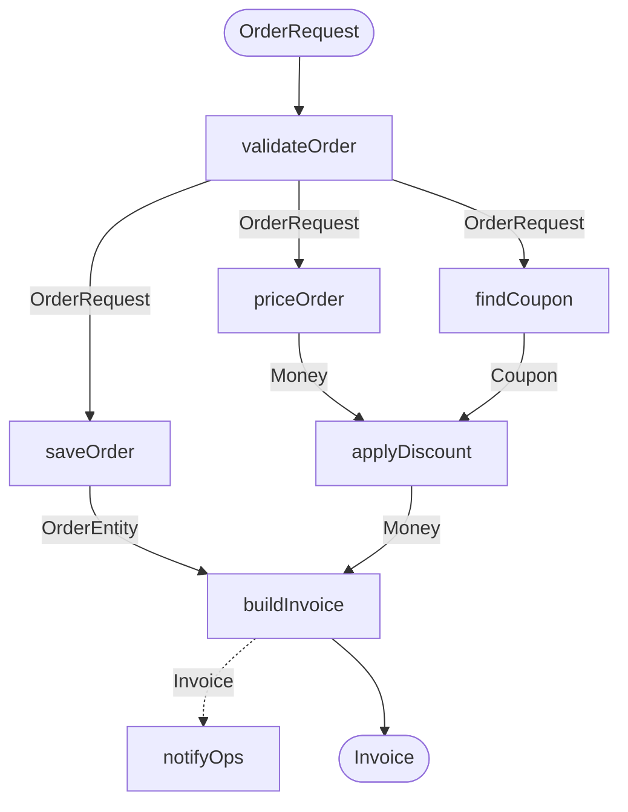

# Use cases

A use case is a graph of steps, written in a [definition file](definition-files.md) under
`src/main/resources/enact/`:

```yaml title="src/main/resources/enact/orders.yaml"
use-cases:
  createOrder: # (1)!
    description: Validates, prices and stores a new order
    trigger: { ... } # (2)!
    steps:
      - step: validateOrder
      - step: saveOrder # (3)!
        settings: { ... } # (4)!
      - step: priceOrder
        in: $validateOrder # (5)!
      - step: findCoupon
        in: $validateOrder
      - step: applyDiscount
        in: { price: $priceOrder, coupon: $findCoupon } # (6)!
        when: "#coupon != null" # (7)!
      - step: buildInvoice
        in: { order: $saveOrder, price: $applyDiscount }
      - step: notify
        id: notifyOps # (8)!
        in: { invoice: $buildInvoice }
        side: true # (9)!
```

1.  The key names the use case and the Spring bean Enact registers for it. It is used once across every
    definition file.
2.  Optional, at most one. See [HTTP trigger](http-trigger.md) or [Custom trigger](custom-trigger.md).
3.  Nothing is bound, so it reads the step declared before it. The first step reads the use case's input.
4.  Optional, see [Retry and cache](step-settings.md).
5.  `$validateOrder` names another step's output, so this one reads it instead of the step above.
6.  A step taking several parameters binds each of them by name.
7.  SpEL. The step runs only when it holds; each of its inputs is readable by parameter name.
8.  Identifies the step within the use case, so the same step can appear twice.
9.  Runs aside: off the caller's thread, never waited for, never read.

Every file of that folder is read, so each domain keeps its own. They can also be listed somewhere else; see
[Definition files](definition-files.md).

The bindings draw the graph. Two steps read the same value, two values meet in one step, and one step runs
aside:



## Binding inputs

A value comes from somewhere with `in`. A reference starts with `$`:

| Reference | Where the value comes from |
|---|---|
| `$input` | the use case's own input |
| `$<step id>` | the output of another step of the same use case |

A step taking one parameter binds it as a single reference, `in: $saveOrder`. A step taking several binds each
of them by name, `in: { order: $saveOrder, price: $applyDiscount }`. A [step written as an annotated
method](steps.md#several-parameters) is the only one that can take several; a hand-written `Step` bean takes
one, named `input`.

Leaving `in` out is the short form for a step with a single parameter: it reads the step declared before it,
or the use case's input when it is the first. A chain of steps therefore stays as short as it was:

```yaml
steps:
  - step: validateOrder # reads the use case's input
  - step: saveOrder     # reads validateOrder
  - step: mapOrder      # reads saveOrder
```

A step may only bind to a step declared **above** it. Declaration order is then already a topological order,
and a cycle cannot be written in the first place.

!!! note "Without `$` a value is a literal"
    `in: saveOrder` is rejected rather than read as a reference. That is what makes `else: 0` unambiguously
    the number zero, and `else: $price` unambiguously an input.

## The input and the output

The use case's input type is the type every step reading `$input` expects. They must all expect the same one.
A use case no step of which reads the input takes `Unit`.

The output is the one step whose output nothing reads. Two candidates stop the application, naming both —
`output` picks one:

```yaml
use-cases:
  priceOrder:
    output: price # (1)!
    steps:
      - step: price
      - step: recordQuote
        in: $input
```

1.  Without it, `price` and `recordQuote` are both terminal and Enact cannot choose.

Feeding a step that runs aside does not use a value up: nothing waits for what that step produces, so the step
feeding it is still free to be the one the use case returns. In the order example above, `buildInvoice` is the
output although `notifyOps` reads it.

## Running a step twice

A step's id defaults to its name, and ids are unique within a use case. Give an `id` to use the same step
twice:

```yaml
steps:
  - step: normalize
    id: normalizeShipping
    in: $input
  - step: normalize
    id: normalizeBilling
    in: $input
  - step: compareAddresses
    in: { shipping: $normalizeShipping, billing: $normalizeBilling }
```

## Conditions

`when` is a SpEL expression. The step runs only when it holds. Each of the step's inputs is readable by
parameter name, and `#input` names the only one of a step taking a single parameter:

```yaml
steps:
  - step: priceOrder
  - step: findCoupon
    in: $input
  - step: applyDiscount
    in: { price: $priceOrder, coupon: $findCoupon }
    when: "#coupon != null"
```

The expression is evaluated against a read-only data binding context with instance methods: it reads the
inputs and calls methods on them, but it cannot reference beans or types.

`else` says what a skipped step yields:

```yaml
steps:
  - step: findCustomer
  - step: priceOrder
    in: $input
  - step: applyLoyaltyBonus
    in: { price: $priceOrder, customer: $findCustomer }
    when: "#customer.loyal"
    else: $price # (1)!
  - step: buildQuote
    in: { customer: $findCustomer, price: $applyLoyaltyBonus }
```

1.  Passes one of the step's own inputs through. Its type must stand in for the step's output.

A value that is not a reference is a literal, read into the step's output type at startup, so a mistyped one
fails the application rather than a request:

```yaml
- step: countRetries
  in: $input
  when: "#input.retried"
  else: 0
```

Left out, `else` is inferred as the only input that can stand in for the step's output. Zero candidates or
more than one is a startup error naming them. A step nothing reads needs no fallback at all — there is no
value to produce.

A skipped step is not observed: nothing ran to measure.

## Running steps at once

Steps that do not read each other can run at the same time. They do not by default:

```yaml
use-cases:
  createOrder:
    concurrent: true
    steps: [...]
```

!!! warning "Why this is off by default"
    A step moved off the caller's thread leaves a surrounding `@Transactional` behind, along with the
    `SecurityContext` and the MDC of the thread that started the use case. Turning `concurrent` on is a
    decision about those, so Enact does not make it for you.

With `concurrent: true`, the graph runs level by level — a level being the steps whose inputs are all ready —
and the steps of a level run at once. In the order example, `saveOrder`, `priceOrder` and `findCoupon` are one
level.

Steps run on the application's `AsyncTaskExecutor` bean when there is one, and on virtual threads otherwise. A
Micrometer `ContextSnapshot` is restored around each step, so spans keep nesting under the use case's, and the
MDC and security context follow whatever registered a `ThreadLocalAccessor`.

When a step fails, the next level does not start. The steps already running are awaited rather than
interrupted — interrupting a blocking call is not something Enact can promise. The first exception reaches the
caller unchanged, with the others attached as suppressed.

## Running a step aside

`side: true` starts a step off the caller's thread and never waits for it, whether or not the use case is
`concurrent`:

```yaml
- step: notify
  in: { invoice: $buildInvoice }
  side: true
```

Nothing may read a step that runs aside; binding to one fails at startup. Its failure cannot reach the caller
either, so it is logged and recorded as an error on the `enact.step`
[observation](observability.md). `retry` settings still apply, so a step run aside retries on its own thread
before that happens.

!!! warning "A step run aside is not guaranteed to finish"
    Nothing waits for it, the application shutting down included: a step still running then may be cut short.
    Use it for work that may be lost, such as a notification, and not for work that must happen. Something
    that must happen belongs in the use case, or behind a queue that can redeliver it.

## Errors

There is no `break`. A step that must stop the use case throws, and the exception reaches the caller as it is.
Mapping it to a response is the application's job: `@ExceptionHandler` and `ProblemDetail` work as usual, and
they keep working for a use case that is not exposed over HTTP.

## Validation

Enact builds and checks every use case at startup. If any check fails, the application does not start, and the
error names the use case and the steps involved.

**Steps and types**

- a use case declares at least one step, and every `step` resolves to a registered step,
- step ids are unique within the use case,
- every key of `in` is a parameter of the step, and every parameter is bound,
- a step only binds to a step declared above it,
- each edge's producer type is assignable to the parameter it feeds, generics included — `ArrayList<Order>`
  feeds a `List<Order>` parameter, `List<Order>` does not feed a `List<String>` one, and `int` feeds an
  `Integer`, and
- every step reading `$input` expects the same type.

**Shape of the graph**

- exactly one step whose output nothing reads, unless `output` names one,
- nothing binds to a step that runs aside, and
- a conditional step another step reads has a determinate `else`.

**Settings, groups and triggers**

- a step using `cache` has a `CacheManager` that knows the cache name,
- a use case's `group` is declared, and each of its filters is a bean of the kind the trigger expects, and
- a use case declares at most one trigger, of a type with a registered `TriggerHandler`.

The [definition files](definition-files.md#what-enact-checks) themselves are checked before any of this.

## Injecting a use case

Every use case is a Spring bean of type `UseCase<Input, Output>`. You can inject it by its type:

=== "Kotlin"

    ```kotlin
    @RestController
    class OrderController(
        private val createOrder: UseCase<OrderRequest, Invoice>,
    ) {
        @PostMapping("/orders")
        fun create(@RequestBody payload: OrderRequest): Invoice = createOrder.execute(payload)
    }
    ```

=== "Java"

    ```java
    @RestController
    public class OrderController {
        private final UseCase<OrderRequest, Invoice> createOrder;

        public OrderController(UseCase<OrderRequest, Invoice> createOrder) {
            this.createOrder = createOrder;
        }

        @PostMapping("/orders")
        public Invoice create(@RequestBody OrderRequest payload) {
            return createOrder.execute(payload);
        }
    }
    ```

Enact matches the generic types against the use case's actual input and output types. If several use cases
have the same types, pick one by parameter name (the use case name) or with `@Qualifier("createOrder")`.

A use case without a `trigger` is only available through injection.

## Disabling Enact

```yaml
enact:
  enabled: false
```
